# Etechflow Abandoned Cart Email & Exit-Intent Popup

**User Guide & Reference Documentation**

Version: **1.2.0**
Last Updated: June 2026
Vendor: **ETechFlow**
Compatibility: Magento 2.4.4+ / Adobe Commerce / Luma / Hyvä

---

## Table of Contents

1. [Introduction](#1-introduction)
2. [Key Features](#2-key-features)
3. [Installation](#3-installation)
4. [License Activation](#4-license-activation)
5. [System Configuration](#5-system-configuration)
6. [Abandoned Cart Email Recovery](#6-abandoned-cart-email-recovery)
   - 6.1 Email Rules Overview
   - 6.2 Creating an Email Rule
   - 6.3 Email Templates
   - 6.4 Tracking & Recovery Detection
7. [Exit-Intent Popup System](#7-exit-intent-popup-system)
   - 7.1 Popup Rules Overview
   - 7.2 Creating a Popup Rule
   - 7.3 Trigger Types
   - 7.4 Visual Design (v1.2.0)
   - 7.5 Mobile Behavior (v1.2.0)
   - 7.6 Discount Linkage
8. [Reports & Analytics](#8-reports--analytics)
9. [Admin Permissions (Role-Based Access)](#9-admin-permissions-role-based-access)
10. [Storefront Customer Experience](#10-storefront-customer-experience)
11. [Troubleshooting](#11-troubleshooting)
12. [Technical Reference](#12-technical-reference)
13. [Changelog](#13-changelog)
14. [Support](#14-support)

---

## 1. Introduction

**Etechflow Abandoned Cart Email & Exit-Intent Popup** is a Magento 2 extension that helps merchants recover lost sales through two complementary channels:

- **Email Recovery** — automatically sends scheduled reminder emails to customers who abandon their shopping carts.
- **Exit-Intent Popups** — displays on-site popups when visitors show signs of leaving, with one-click coupon application.

Both systems work independently or together, sharing a unified configuration, analytics dashboard, and license validator.

### Who This Extension Is For

- Merchants experiencing cart abandonment (industry average: 70%+)
- Stores running email marketing or paid acquisition
- Brands wanting to convert exit-intent visitors before they leave

### Compatibility

| Component | Supported Versions |
|---|---|
| Magento Open Source | 2.4.4, 2.4.5, 2.4.6, 2.4.7, 2.4.8, 2.4.9 |
| Adobe Commerce | 2.4.4+ |
| PHP | 8.1, 8.2, 8.3, 8.4 |
| Themes | Luma, Hyvä, custom themes (theme-neutral CSS) |
| Multi-store | Full support (per-store rule targeting) |
| B2B (Adobe Commerce) | Compatible |

---

## 2. Key Features

### Email Recovery System (v1.0.0)

| Feature | Description |
|---|---|
| **Real-time cart tracking** | Observer captures cart on every change |
| **Multi-rule email sequence** | Define unlimited rules with different time intervals |
| **Pre-built templates** | 3 ready-to-use designs (Luma, Hyvä, With-Coupon) |
| **Custom template support** | Use Magento's native template editor |
| **One-click cart restore** | Customer clicks email → cart pre-filled at checkout |
| **Auto-stop on order placement** | No further emails after customer completes purchase |
| **Open & click tracking** | Per-email engagement analytics |
| **Unsubscribe handling** | GDPR-compliant opt-out link in every email |
| **Frequency caps** | Per-rule and global max emails per cart |
| **Customer group filtering** | Target specific groups, exclude guests if desired |
| **Cart subtotal filters** | Min/max thresholds per rule |

### Exit-Intent Popup System (v1.1.0)

| Feature | Description |
|---|---|
| **4 trigger types** | Exit Intent, Time on Page, Scroll Depth, Cart Subtotal |
| **5 page scopes** | All Pages, Cart, Checkout, Category, Product |
| **Multiple popup rules** | Unlimited rules with priority-based selection |
| **Customer group targeting** | Per-rule audience selection |
| **One-click coupon apply** | Linked Magento Cart Price Rule, instant cart discount |
| **Frequency caps** | once_per_session / once_per_day / once_per_lifetime |
| **Impression limits** | Hard cap per visitor (lifetime or session) |

### Visual Design (v1.2.0)

| Feature | Description |
|---|---|
| **4 layout templates** | Modal, Slide-In, Bottom Bar, Top Bar |
| **5 color customization fields** | Background, headline, body, CTA button, CTA text |
| **4 entrance animations** | Fade In, Slide Up, Zoom In, Bounce |
| **Border radius + width** | Per-rule rounded corners and dialog size |
| **Mobile exit-intent** | Auto-detected device → visibilitychange + fallback timer |
| **Configurable mobile fallback** | Admin-editable timeout (default 15 seconds) |

### Analytics & Reporting

- Email metrics — sent, opened, clicked, converted, recovery rate, revenue recovered
- Popup metrics — impressions, accepted, dismissed, converted, conversion rate
- Per-rule breakdowns with date range filter
- Visual KPI dashboard cards

### Technical Highlights

- HMAC-signed license validation
- CSRF-aware AJAX endpoints
- Open-redirect mitigation on tracking links
- Idempotent recovery detection (observer + plugin defense-in-depth)
- Magento Marketplace coding standards
- Full Hyvä theme compatibility (separate template + layout)

---

## 3. Installation

### Prerequisites

- Magento 2.4.4 or higher
- PHP 8.1+
- Composer
- Admin access to your Magento server
- SSH/CLI access

### Installation Steps

**Option A: Composer (recommended)**

```bash
composer require etechflow/module-abandoned-cart
bin/magento module:enable Etechflow_AbandonedCart
bin/magento setup:upgrade
bin/magento setup:di:compile     # production mode only
bin/magento cache:flush
```

**Option B: Manual ZIP upload**

1. Download extension ZIP from your account
2. Extract into `app/code/Etechflow/AbandonedCart/`
3. Run the same Magento commands above

### Verify Installation

```bash
bin/magento module:status Etechflow_AbandonedCart
```

Expected output: `Module is enabled`.

Optionally run the bundled health check:

```bash
bin/magento etechflow:abc:verify
```

This runs 14 end-to-end checks (DB tables, repositories, source models, round-trip tests). All should pass.

---

## 4. License Activation

After installation, your extension is in unlicensed state. To activate:

### Step 1 — Obtain Your License Key

Your license key was emailed when you purchased the extension. The key is **host-locked** to your storefront domain (e.g., `yourshop.com`).

If you don't have the key, contact ETechFlow Support with:
- Your purchase email / receipt
- The exact domain you'll deploy the extension on

### Step 2 — Enter the Key in Admin

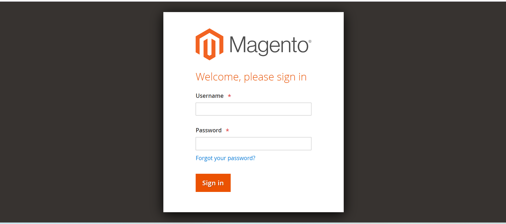

*Figure 1: Magento Admin login screen.*

Navigate to:

`Admin → Stores → Configuration → ETechFlow → Abandoned Cart Email → License`


*Figure 2: License Key configuration section.*

Paste the full license key (format: `yourdomain.com|HMAC-SIGNATURE`) into the **License Key** field.

Set **Production Environment** to **Yes**.

Click **Save Config**.

Flush cache:

```bash
bin/magento cache:flush
```

### Step 3 — Verify Activation

```bash
bin/magento etechflow:abc:verify
```

The "LicenseValidator works" check should show ✓ OK.

If the license key doesn't validate, the extension silently disables itself — no emails sent, no popups shown — but no errors thrown.

---

## 5. System Configuration

All extension-wide settings live under:

`Admin → Stores → Configuration → ETechFlow → Abandoned Cart Email`

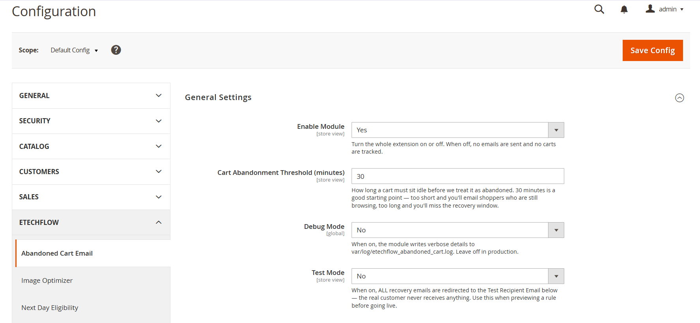

*Figure 3: Configuration page — ETechFlow Abandoned Cart Email section.*

The configuration is grouped into **8 sections** described below. Each setting can be overridden per store view in multi-store setups (use the **Store View** dropdown at the top-left of the configuration page).

### 5.1 General Settings

Controls the master switch and core behavior.

| Field | Default | Description |
|---|---|---|
| **Enable Extension** | Yes | Master on/off. Disable to stop all emails + popups instantly. |
| **Abandonment Threshold (minutes)** | 30 | How long a cart must be idle before it counts as "abandoned" and becomes eligible for emails. |
| **Test Mode** | No | When ON, all emails are redirected to the Test Recipient Email (safety mechanism during testing). |
| **Test Recipient Email** | — | Where Test Mode redirects all customer emails. Leave blank when going to production. |
| **Debug Mode** | No | Verbose logging to `var/log/system.log` and `var/log/exception.log`. |

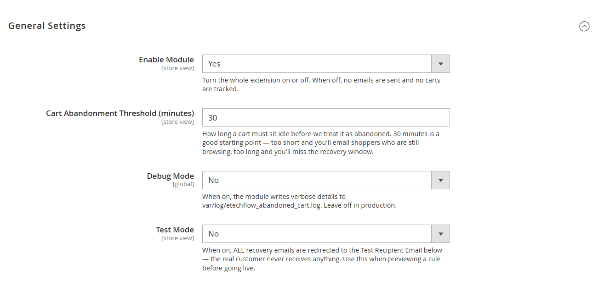

*Figure 4: General Settings fieldset.*

**Recommended Production Setup:**

```
Enable Extension:           Yes
Abandonment Threshold:      30 minutes (or longer if checkout flow is slow)
Test Mode:                  No
Debug Mode:                 No (only enable when troubleshooting)
```

### 5.2 Email Sending Settings

Controls who emails come from and global send caps.

| Field | Default | Description |
|---|---|---|
| **Sender Identity** | General Contact | Magento email-identity preset used as "From" — configure under `Stores → Configuration → General → Store Email Addresses`. |
| **Maximum Emails Per Cart** | 3 | Hard global cap. No matter how many rules match, no cart receives more than this number. |
| **BCC Email** | — | Optional. Get a copy of every customer email sent (useful for monitoring). |
| **Reply-To Email** | — | Optional. Where customer replies go (else Sender Identity's reply-to is used). |

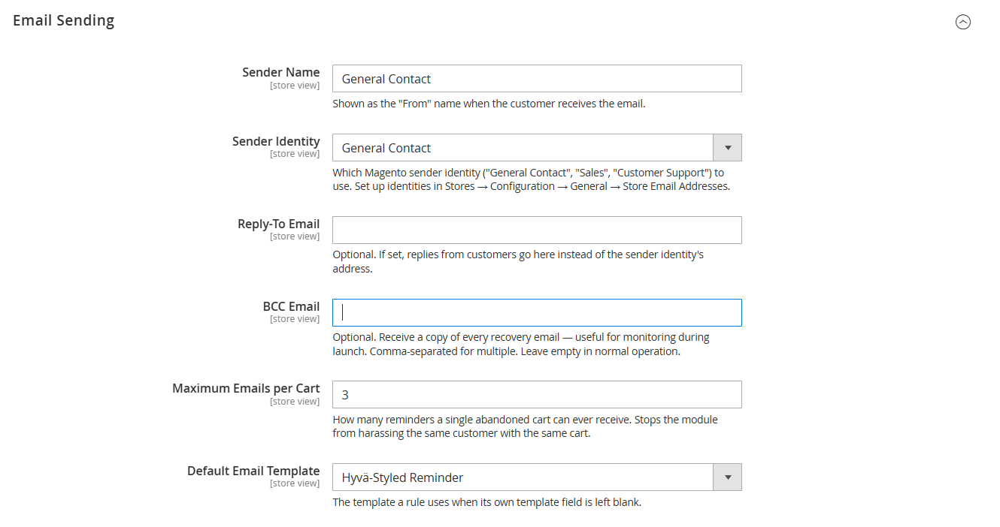

*Figure 5: Email Sending Settings fieldset.*

**Note:** The actual SMTP transport is configured separately under `Admin → Stores → Configuration → Advanced → System → Mail Sending Settings` (Magento native). Our extension uses whatever Magento's transport is set to (sendmail, SMTP, etc.).

### 5.3 Restore Settings

Controls how cart-restore links behave when customers click email buttons.

| Field | Default | Description |
|---|---|---|
| **Restore Token Expiry (days)** | 30 | After this many days, restore links stop working. Prevents stale email clicks from working forever. |
| **Auto-Login Customer on Restore** | Yes | When customer clicks email link, if they were logged in originally, log them back in automatically. |
| **Merge with Existing Cart** | Yes | If customer started a new cart in the meantime, merge items instead of replacing. |

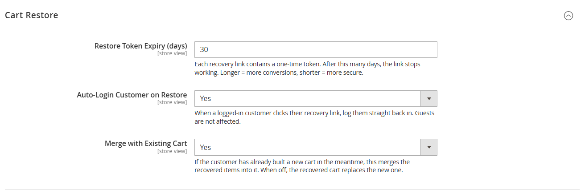

*Figure 6: Restore Settings fieldset.*

### 5.4 Tracking Settings

| Field | Default | Description |
|---|---|---|
| **Open Tracking** | Yes | Embed 1x1 transparent pixel in emails to detect when customer opens them. |
| **Click Tracking** | Yes | Rewrite email links through tracking redirect to count clicks. |
| **UTM Source** | etechflow_abandoned_cart | Auto-appended to restore URLs for Google Analytics attribution. |
| **UTM Medium** | email | GA campaign medium. |
| **UTM Campaign** | abandoned_cart_recovery | GA campaign name. |

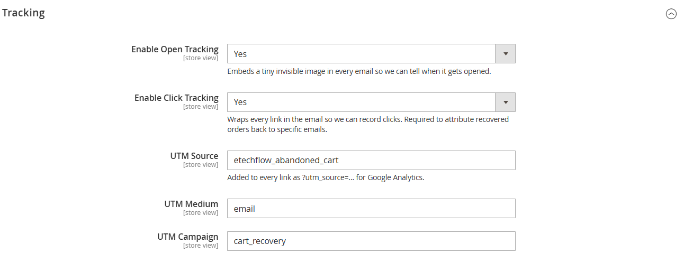

*Figure 7: Tracking Settings fieldset.*

### 5.5 Cron Settings

| Field | Default | Description |
|---|---|---|
| **Batch Size** | 50 | How many carts to process per cron run. Adjust based on store volume. |
| **Lock Timeout (minutes)** | 30 | If a cron run hangs longer than this, the lock is considered stale and the next run takes over. |
| **Max Runtime (seconds)** | 60 | Hard stop. Cron stops processing after this even if more candidates remain. |

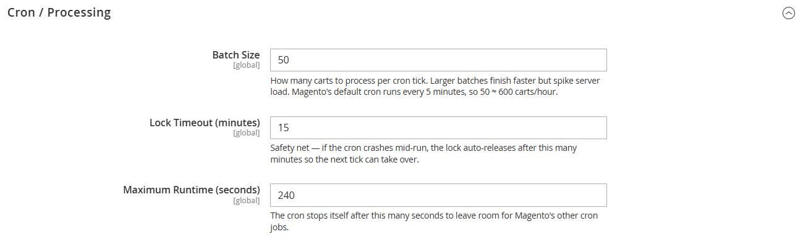

*Figure 8: Cron Settings fieldset.*

**Cron Requirement:** Magento cron must be running on your server. Verify with:

```bash
crontab -l       # should show "bin/magento cron:run" entry
```

If not, install via:

```bash
bin/magento cron:install
```

### 5.6 Retention Settings

| Field | Default | Description |
|---|---|---|
| **Log Retention (days)** | 90 | How long email_log rows are kept before cleanup cron deletes them. |
| **Expired Cart Retention (days)** | 180 | How long abandoned_cart rows (in expired status) are kept. |

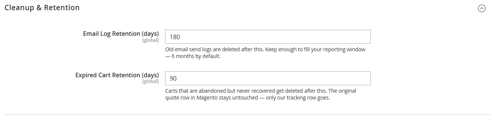

*Figure 9: Retention Settings fieldset.*

### 5.7 Hyvä Compatibility

| Field | Default | Description |
|---|---|---|
| **Hyvä Theme Detection** | Auto | Auto detects if storefront uses Hyvä and switches to Hyvä-optimized templates. |

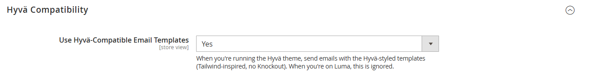

*Figure 10: Hyvä Compatibility fieldset.*

### 5.8 License Settings

Already covered in Section 4 — license key entry and validation.

---

## 6. Abandoned Cart Email Recovery

This is the extension's flagship feature — automatically emails customers who leave items in their cart without completing checkout.

### 6.1 How It Works (High-Level Flow)

```
1. Customer adds product to cart
       ↓
2. Observer captures cart snapshot in our DB (status: pending)
       ↓
3. Customer leaves site without purchasing
       ↓
4. Cron checks every 5 minutes for carts past the "abandonment threshold"
       ↓
5. For each eligible cart, cron picks the next applicable Email Rule
   (based on sequence_number + send_after_minutes)
       ↓
6. Email queued → transactional email sent via Magento SMTP
       ↓
7. Customer opens email → tracking pixel hit (status: opened)
       ↓
8. Customer clicks "Complete Purchase" → restore link (status: clicked)
       ↓
9. Original cart restored at /checkout/cart
       ↓
10. Customer completes order → order_place_after event
        ↓
11. RecoveryService.markRecovered() → cart status: recovered
        ↓
12. All future emails for this cart suppressed (status filter excludes recovered)
```

### 6.2 Email Rules Grid

Navigate to:

`Admin → Marketing → ETechFlow Abandoned Cart → Email Rules`

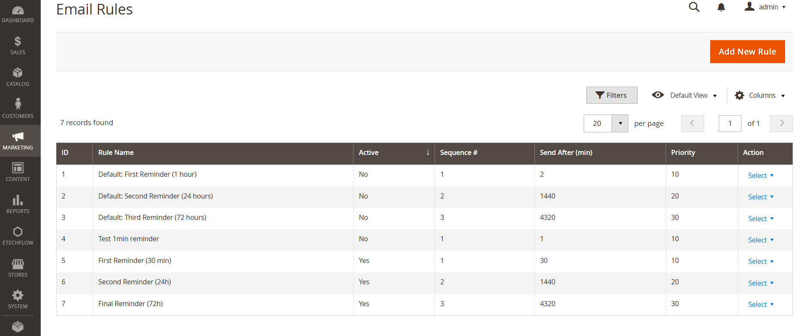

*Figure 11: Email Rules listing grid in admin.*

**Grid Features:**

| Element | Purpose |
|---|---|
| **Add New Rule** button (top-right) | Creates a fresh rule |
| **Filter** controls | Search by name, filter by Active status |
| **Sort** any column header | Default sort: Priority ASC |
| **Per-row Edit / Delete** | Right-side actions column |
| **ID column** | Internal rule_id (used when troubleshooting) |

### 6.3 Creating an Email Rule

Click **Add New Rule**. The form opens with 4 fieldsets.

#### General Information

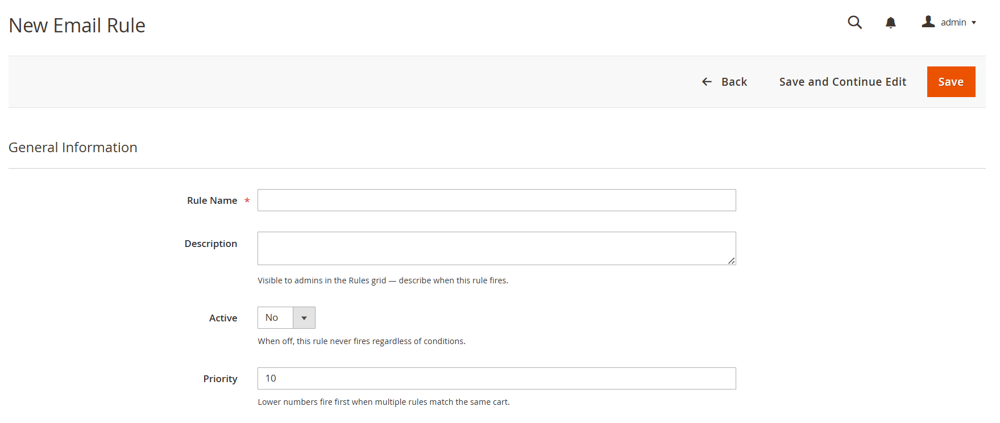

*Figure 12: Email Rule edit form — General Information fieldset.*

| Field | Notes |
|---|---|
| **Rule Name** | Required. Internal label only (not shown to customers). |
| **Description** | Optional. Visible to admins in the grid. |
| **Active** | Yes/No master toggle for this specific rule. |
| **Priority** | Lower number = evaluated first. Used as tiebreaker when multiple rules match. |

#### Schedule

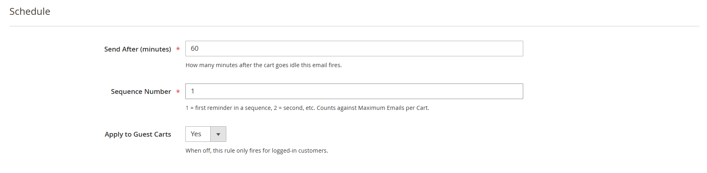

*Figure 13: Email Rule form — Schedule fieldset.*

| Field | Notes |
|---|---|
| **Send After (minutes)** | How long after the cart is idle this rule fires. E.g., 30 = first reminder; 1440 = 24h; 4320 = 72h. |
| **Sequence Number** | This rule's position in the sequence (1 = first email, 2 = second, etc.). The same cart won't receive an email from a rule whose `sequence_number ≤ cart.emails_sent`. |
| **Apply to Guest Carts** | Yes = guests get emails too; No = only logged-in customer carts. |

**Typical 3-Email Sequence:**

| Sequence | Send After | Rule Name | Strategy |
|---|---|---|---|
| 1 | 30 minutes | First Reminder | Polite "you forgot something" |
| 2 | 1440 (24h) | Second Reminder | Include 10% discount coupon |
| 3 | 4320 (72h) | Final Reminder | Bigger discount, urgency framing |

#### Email

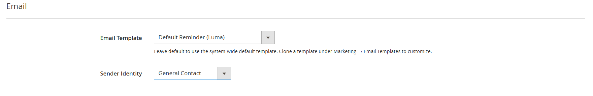

*Figure 14: Email Rule form — Email fieldset with template dropdown.*

| Field | Notes |
|---|---|
| **Email Template** | Choose from the 3 pre-built templates or a custom one you cloned (see Section 6.5). |
| **Sender Identity** | Magento email-identity preset for "From" address. |

#### Targeting

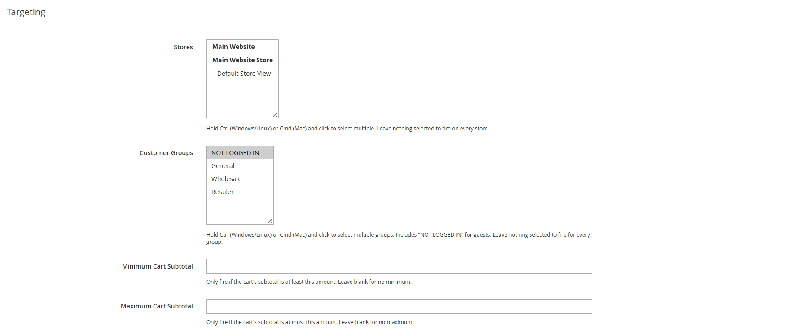

*Figure 15: Email Rule form — Targeting fieldset.*

| Field | Notes |
|---|---|
| **Stores** | Multi-select. Hold Ctrl/Cmd to choose multiple. Leave empty for all stores. |
| **Customer Groups** | Multi-select. Includes "NOT LOGGED IN" for guests. |
| **Minimum Cart Subtotal** | Optional. Cart must be ≥ this value. Leave blank for no minimum. |
| **Maximum Cart Subtotal** | Optional. Cart must be ≤ this value. Useful for tiered offers. |

Click **Save** (or **Save and Continue Edit**) at top-right. Grid will reload with the new rule.

### 6.4 Email Templates — Three Pre-Built Designs

The extension ships with 3 ready-to-use email templates. Choose one in the Email Rule's **Email Template** dropdown.

| Template | File | Style |
|---|---|---|
| **Default Reminder (Luma)** | `abandoned_cart_default.html` | Classic Luma — clean, brand-neutral |
| **Hyvä-Styled Reminder** | `abandoned_cart_hyva.html` | Modern, minimal, Inter font |
| **Default Reminder + Discount Coupon** | `abandoned_cart_with_coupon.html` | Prominent coupon code box |

Each template includes:

- Customer first name greeting (if available)
- Store name personalization
- Cart items list (image, name, qty, price)
- "Complete Your Purchase" CTA button → restore link
- Open-tracking pixel
- Click-tracking on all links
- GDPR-compliant unsubscribe footer

### 6.5 Customizing Email Templates

To customize the look/copy without editing extension files:

1. Navigate to `Admin → Marketing → Communications → Email Templates → Add New Template`
2. From the **Load Default Template** dropdown, choose one of the 3 ETechFlow templates
3. Click **Load Template**
4. Edit subject, content (HTML supported), styling
5. Give it a name (e.g., "Black Friday Reminder")
6. Save Template
7. Now open your Email Rule, choose this custom template from the Email Template dropdown

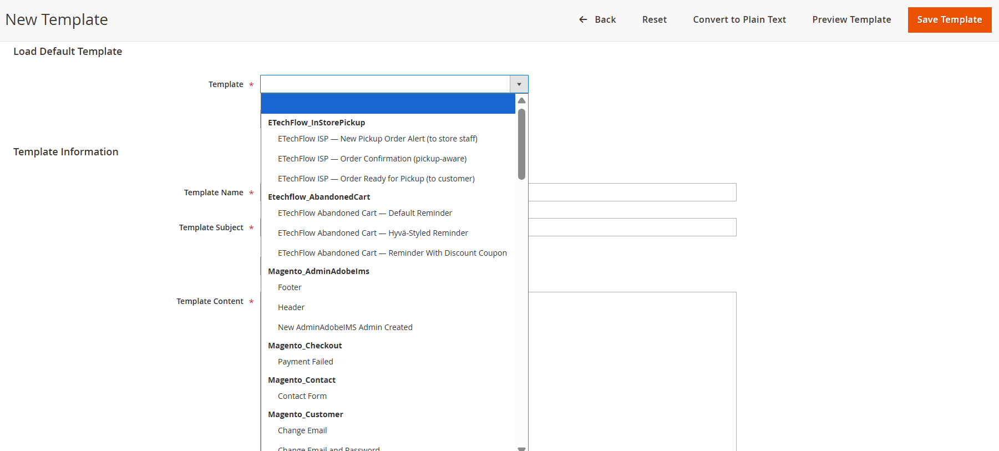

*Figure 16: Magento's Email Templates page with ETechFlow templates available.*

You can create unlimited custom templates and assign different ones to different rules.

### 6.6 Tracking & Recovery Detection

The extension tracks every email touchpoint:

| Action | Status | DB Column |
|---|---|---|
| Email queued by cron | sent | `email_log.status = 2` |
| Customer opens email (pixel hit) | opened | `email_log.opened_at` timestamp + status update |
| Customer clicks any link | clicked | `email_log.clicked_at` + status update |
| Customer places order from restored cart | converted | `email_log.status = 5` + `abandoned_cart.recovered_at` |

**Recovery Detection (2 Layers — Defensive)**

| Layer | Trigger | Why |
|---|---|---|
| Observer | `sales_order_place_after` event | Standard Magento order placement |
| Plugin | `Magento\Quote\Model\QuoteManagement::submit` | Catches non-standard order flows |

Both call `RecoveryService::markRecovered()` which is **idempotent** — firing twice is safe. The first call updates the cart's status, the second call sees it's already recovered and does nothing.

### 6.7 Auto-Stop Conditions

Emails stop sending automatically when any of these occur:

| Condition | Verified In Code? |
|---|---|
| Customer places an order | ✅ Yes (Path A + B) |
| Customer unsubscribes via email link | ✅ Yes (sets status: unsubscribed) |
| Max emails per cart cap is hit | ✅ Yes (cron filter on emails_sent < cap) |

> **Note:** Two additional auto-stop conditions are planned for v1.3.0 — "stop after email click" and "skip if cart item is out of stock". Track the changelog for updates.

---

## 7. Exit-Intent Popup System

Real-time on-site recovery — show a popup when a visitor is about to leave, with one-click coupon application.

### 7.1 How Popups Work (Visitor Side)

```
1. Visitor lands on a page → JS handler loads
       ↓
2. Handler reads rule config + calls /popup/get for matching rules
       ↓
3. First matching rule selected (by priority — lower number wins)
       ↓
4. Trigger listener attached based on rule.trigger_type:
   - Desktop + exit_intent  → mouseout (top viewport)
   - Mobile + exit_intent   → visibilitychange + fallback timer
   - time_on_page           → setTimeout(N seconds)
   - scroll_depth           → scroll event with % threshold
   - cart_subtotal_threshold → immediate (already matched)
       ↓
5. Trigger fires → popup renders in chosen layout (modal/slide-in/bar)
       ↓
6. /popup/track logs impression (DB row created)
       ↓
7. Visitor clicks CTA →
   - If rule has linked Cart Price Rule: generate single-use coupon,
     auto-apply to current cart via /popup/apply
   - If no discount linked: simply close popup
       ↓
8. Success message shown with coupon code, OR popup closes
```

### 7.2 Popup Rules Grid

Navigate to:

`Admin → Marketing → ETechFlow Abandoned Cart → Popup Rules`

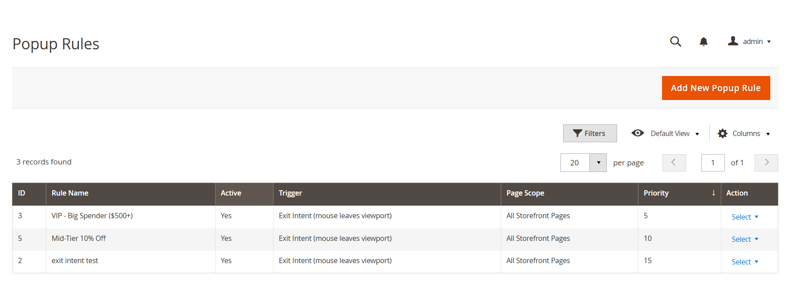

*Figure 17: Popup Rules listing grid.*

**Grid Features:**

| Element | Purpose |
|---|---|
| **Add New Popup Rule** button (top-right) | Creates a fresh popup rule |
| **Trigger column** | Quick view of which trigger fires this popup |
| **Page Scope column** | Which storefront pages this rule applies to |
| **Priority column** | Tiebreaker when multiple rules match the same visitor — lower wins |
| **Default sort** | Priority ASC (highest-priority rule at top) |

### 7.3 Creating a Popup Rule

Click **Add New Popup Rule**. Form opens with **6 fieldsets**.

#### 7.3.1 General Information

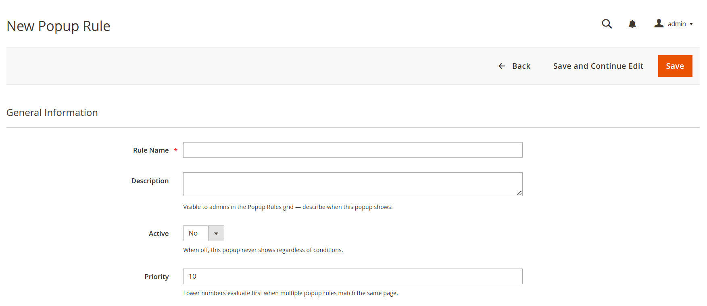

*Figure 18: Popup Rule form — General Information fieldset.*

| Field | Notes |
|---|---|
| **Rule Name** | Internal label only. |
| **Description** | Visible in grid only — describe when this rule fires. |
| **Active** | Master toggle for this rule. |
| **Priority** | Lower = higher priority. When multiple rules match the same visitor, lowest-priority rule wins (only one popup shows per page load). |

#### 7.3.2 Trigger

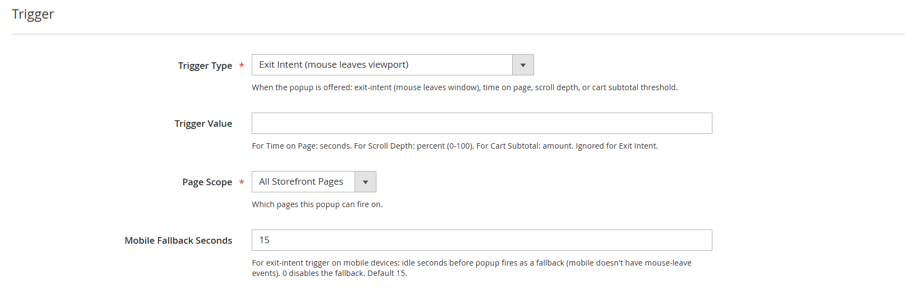

*Figure 19: Popup Rule form — Trigger fieldset with all 4 trigger types.*

| Field | Notes |
|---|---|
| **Trigger Type** | 4 options — see Section 7.4 below |
| **Trigger Value** | Numeric value whose meaning depends on trigger type. Blank for exit_intent. |
| **Page Scope** | Which pages: All / Cart / Checkout / Category / Product |
| **Mobile Fallback Seconds** (v1.2.0) | For exit-intent on mobile: idle timer fallback. Default 15s. 0 disables. |

#### 7.3.3 Popup Content

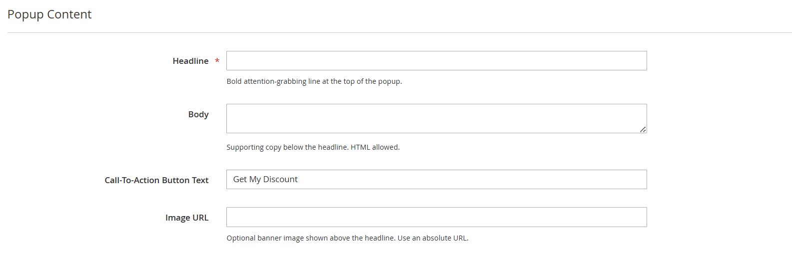

*Figure 20: Popup Rule form — Popup Content fieldset.*

| Field | Notes |
|---|---|
| **Headline** | Required. Bold attention-grabber at top of popup. |
| **Body** | Optional. HTML allowed (inline styles work). Description below headline. |
| **CTA Text** | Button label. Default: "Get My Discount". |
| **Image URL** | Optional. Absolute URL to a banner image shown above the headline. |

**Tip:** Use HTML in Body for richer formatting:

```html
<p style="text-align:center; color:#dc3545;">
    <strong>Limited Time Offer!</strong>
</p>
<ul>
    <li>Free shipping included</li>
    <li>Single-use code</li>
</ul>
```

#### 7.3.4 Discount

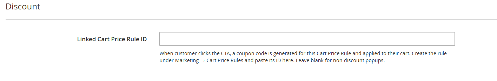

*Figure 21: Popup Rule form — Discount fieldset (linked Cart Price Rule ID).*

| Field | Notes |
|---|---|
| **Linked Cart Price Rule ID** | Optional. Magento Cart Price Rule ID to auto-apply when CTA clicked. Leave blank for non-discount popups (CTA just closes the popup). |

**To Set Up a Discount:**

1. Navigate to `Admin → Marketing → Promotions → Cart Price Rules → Add New Rule`
2. Create the rule (e.g., 10% off, specific coupon type, **Use Auto Generation: Yes**)
3. After saving, the URL shows `id/X` — note this number
4. Paste **X** into the popup rule's **Linked Cart Price Rule ID** field

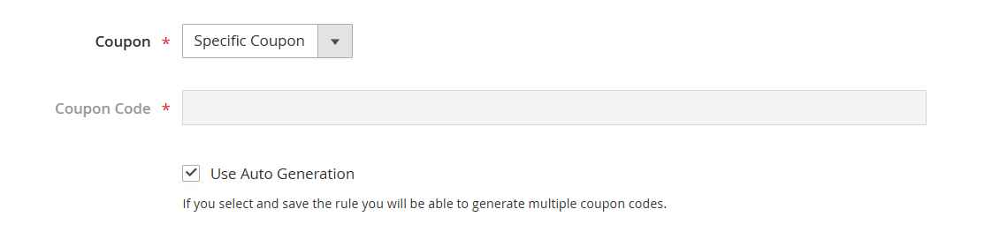

*Figure 22: Magento native Cart Price Rule edit page — must use Specific Coupon + Auto Generation.*

#### 7.3.5 Visual Design (v1.2.0)

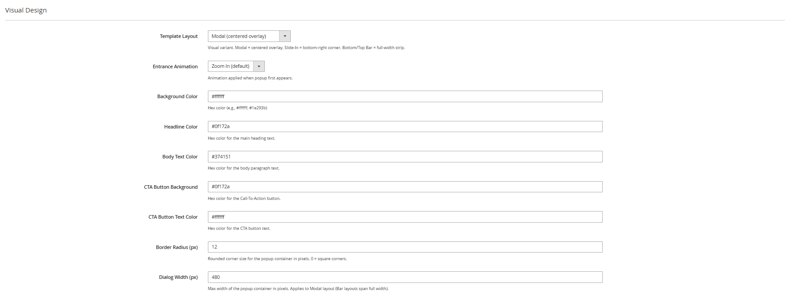

*Figure 23: Popup Rule form — Visual Design fieldset (v1.2.0) with all customization fields.*

The Visual Design fieldset (introduced in v1.2.0) gives admins **per-rule visual customization** without editing CSS files.

| Field | Default | Description |
|---|---|---|
| **Template Layout** | Modal | See Section 7.5 |
| **Entrance Animation** | Zoom In | See Section 7.5 |
| **Background Color** | #ffffff | Popup background hex |
| **Headline Color** | #0f172a | Heading text hex |
| **Body Text Color** | #374151 | Paragraph text hex |
| **CTA Button Background** | #0f172a | Button hex |
| **CTA Button Text Color** | #ffffff | Button text hex |
| **Border Radius (px)** | 12 | Rounded corner size |
| **Dialog Width (px)** | 480 | Modal width (Bar layouts span full width) |

#### 7.3.6 Targeting & Frequency

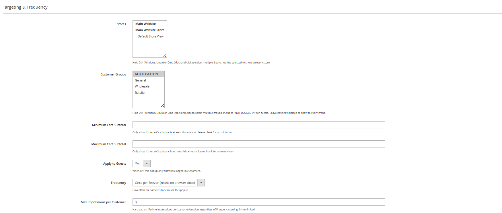

*Figure 24: Popup Rule form — Targeting & Frequency fieldset.*

| Field | Notes |
|---|---|
| **Stores** | Multi-select (Ctrl+click). Leave empty for all stores. |
| **Customer Groups** | Multi-select. Includes "NOT LOGGED IN". |
| **Minimum Cart Subtotal** | Optional. Cart subtotal must be ≥ this. Set to `0.01` to require non-empty cart. |
| **Maximum Cart Subtotal** | Optional. Cap on cart size for this popup. |
| **Apply to Guests** | Yes/No. |
| **Frequency** | once_per_session / once_per_day / once_per_lifetime |
| **Max Impressions per Customer** | Hard lifetime cap (0 = unlimited) |

### 7.4 Trigger Types Deep Dive

| Trigger | When It Fires | Trigger Value | Best Use Case |
|---|---|---|---|
| **Exit Intent** | Visitor moves mouse to top of viewport (desktop) OR switches tab / idle timer (mobile) | (ignored) | Standard "wait, don't go" recovery |
| **Time on Page** | After N seconds on page | Seconds (e.g., 30) | Welcome popup, newsletter signup |
| **Scroll Depth** | After scrolling N% down | Percent (e.g., 50) | Content engagement, mid-article offers |
| **Cart Subtotal Threshold** | When cart subtotal exceeds Min Cart Subtotal | (ignored — uses Min/Max Subtotal in Targeting) | "Spend $X for free shipping" upsell |

### 7.5 Visual Design — 4 Templates + 4 Animations

#### Template Layouts

| Template | Visual | Best Use |
|---|---|---|
| **Modal** (default) | Centered overlay with dark backdrop | General offers — high attention |
| **Slide-In** | Bottom-right corner card | Less intrusive — newsletter, soft offers |
| **Bottom Bar** | Full-width strip at page bottom | Site-wide announcements, urgency banners |
| **Top Bar** | Full-width strip at page top | Critical notifications, sale alerts |

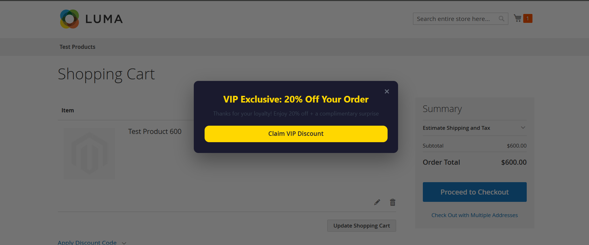

*Figure 25: Storefront popup using Modal layout (centered overlay).*

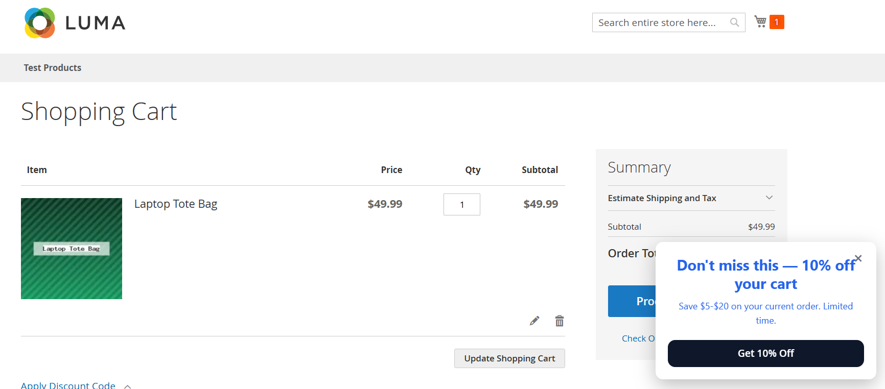

*Figure 26: Storefront popup using Slide-In layout (bottom-right corner card).*

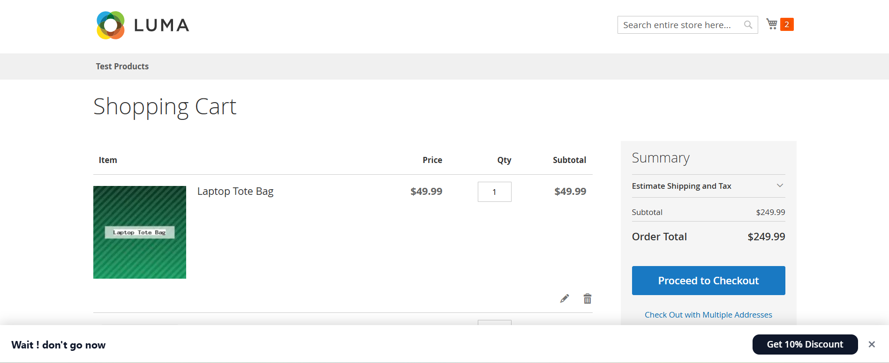

*Figure 27: Storefront popup using Bottom Bar layout.*

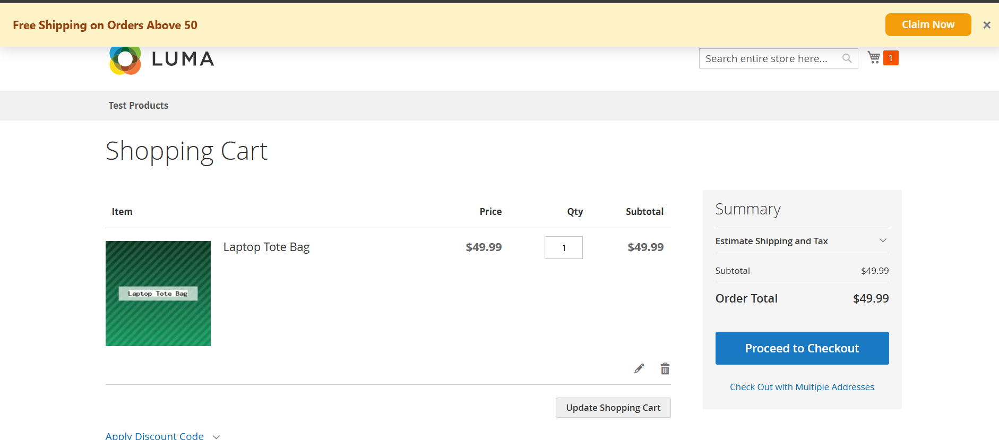

*Figure 28: Storefront popup using Top Bar layout.*

#### Animations

| Animation | Effect | Best Pairing |
|---|---|---|
| **Fade In** | Opacity 0 → 1 (220ms) | Subtle, professional |
| **Slide Up** | Translate from below (280ms) | Mobile-friendly, modern |
| **Zoom In** (default) | Scale 0.94 → 1.0 (220ms) | Universal, attention-grabbing |
| **Bounce** | Spring effect (480ms) | Playful, fun brands |

### 7.6 Mobile Behavior (v1.2.0)

Desktop's `mouseout` event doesn't fire on touch devices — so mobile exit-intent uses different signals:

| Signal | When Fires |
|---|---|
| **visibilitychange** (primary) | Visitor switches to another tab / app / locks screen |
| **Idle Timer** (fallback) | After N seconds of no interaction (admin-configurable, default 15s) |

The JS handler auto-detects device from User-Agent — no per-rule device toggle needed.

**To disable mobile entirely:**

- Set Mobile Fallback Seconds to `0`
- Mobile visitors will only see popup if they actively tab-switch — most won't

### 7.7 Discount Linkage — How Coupon Application Works

When CTA is clicked and a Cart Price Rule is linked:

```
1. JS sends POST /etechflow_abandonedcart/popup/apply
   { rule_id, impression_id }
       ↓
2. Backend (Apply controller):
   - Validates impression belongs to current session
   - Checks idempotency (if already accepted, return same coupon)
       ↓
3. PopupCouponGenerator creates a UNIQUE 12-char alphanumeric coupon
   (uppercase + digits, avoiding 0/O/1/I/L for clarity)
   - Single-use (usage_limit = 1, usage_per_customer = 1)
   - Linked to the popup's Cart Price Rule
       ↓
4. Coupon applied to current quote (cart)
   - quote.setCouponCode(generated_code)
   - quote.collectTotals() recalculates discount
   - cartRepository.save(quote)
       ↓
5. Impression row updated: accepted_at + coupon_code_generated
       ↓
6. JSON response: { success: true, coupon_code: "K7M3PXR9HBQ2" }
       ↓
7. Popup shows green success strip:
   "Your discount code K7M3PXR9HBQ2 has been applied to your cart!"
       ↓
8. Customer clicks Cart → sees Discount line in summary
```

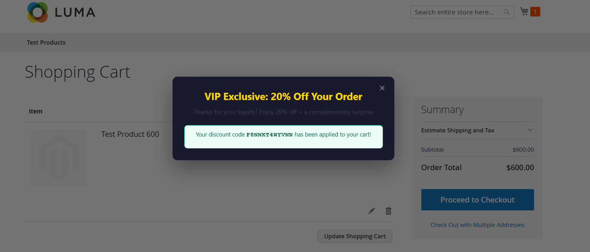

*Figure 29: Popup showing green success strip after coupon application.*


*Figure 30: Cart page showing discount line item in the Summary panel.*

### 7.8 Tiered Discount Strategy Example

Smart merchants set up multiple popup rules with non-overlapping cart subtotal ranges:

| Rule | Cart Range | Discount | Template | Priority |
|---|---|---|---|---|
| Free Shipping Push | $30–$49.99 | Free shipping | Bottom Bar | 15 |
| Mid-Tier Offer | $50–$199 | 10% off | Slide-In | 10 |
| VIP Big Spender | $200+ | 20% off | Modal | 5 |

Each visitor sees exactly **one popup** matched to their cart size — no overlap, no spam. Lower priority number always wins when ranges happen to overlap.

---

## 8. Reports & Analytics

Single unified dashboard showing both email recovery and popup performance.

Navigate to:

`Admin → Marketing → ETechFlow Abandoned Cart → Reports`

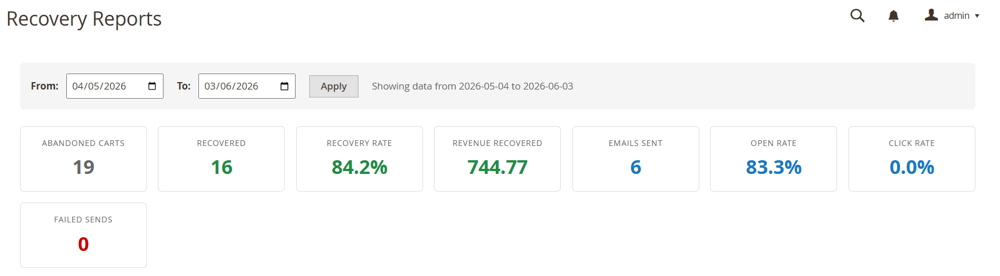

*Figure 31: Reports dashboard — date filter + email KPI cards.*

### 8.1 Date Range Filter

At the top of the dashboard, two date inputs (From / To) let you scope all metrics. Defaults to the last 30 days.

Click **Apply** after changing dates — page reloads with updated metrics.

### 8.2 Email KPI Cards

| Card | Calculation | Meaning |
|---|---|---|
| **Abandoned Carts** | COUNT of carts in window | Total tracked carts (any status) |
| **Recovered** | COUNT where status = recovered | Carts that converted to orders |
| **Recovery Rate** | recovered / abandoned × 100 | Percentage success — industry avg 5-15% |
| **Revenue Recovered** | SUM of recovered_revenue | $ value of recovered orders |
| **Emails Sent** | COUNT of email_log with status ≥ sent | Total emails delivered |
| **Open Rate** | opened / sent × 100 | % of customers who opened email |
| **Click Rate** | clicked / sent × 100 | % who clicked restore link |
| **Failed Sends** | COUNT with status = failed | Bounces, SMTP errors, etc. |

### 8.3 Per-Rule Email Breakdown

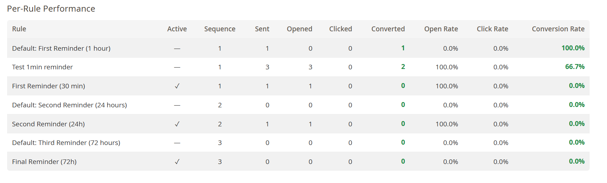

*Figure 32: Per-Email-Rule performance breakdown table.*

Shows each Email Rule's individual performance:

| Column | What |
|---|---|
| **Rule Name** | The Email Rule label |
| **Active** | ✓ if currently enabled, — if disabled |
| **Sequence** | This rule's position in the sequence |
| **Sent** | Emails sent from this rule in date range |
| **Opened / Clicked / Converted** | Engagement counters |
| **Open Rate / Click Rate / Conversion Rate** | Calculated percentages |

Use this to identify which rule converts best — then adjust subject lines / send-time / templates for underperformers.

### 8.4 Popup Performance Section (v1.1.0+)

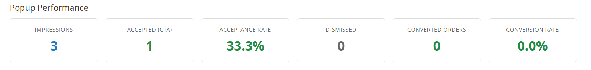

*Figure 33: Popup Performance KPI cards section.*

| Card | Meaning |
|---|---|
| **Impressions** | Total popup views (any rule) in date range |
| **Accepted (CTA)** | Visitors who clicked CTA |
| **Acceptance Rate** | accepted / impressions × 100 |
| **Dismissed** | Visitors who closed without clicking |
| **Converted Orders** | Popups that led to a completed order |
| **Conversion Rate** | converted / accepted × 100 — "of those who clicked, how many bought?" |

### 8.5 Per-Popup-Rule Breakdown

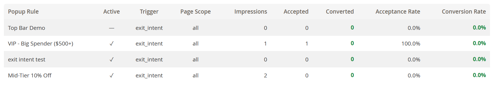

*Figure 34: Per-Popup-Rule performance breakdown table.*

Same as per-email-rule but for popups. Shows trigger type + page scope so you can correlate "which combination converts best".

---

## 9. Admin Permissions (Role-Based Access)

The extension supports Magento's standard role-based access control. Owners can give selective access to marketing staff without exposing sensitive settings.

### 9.1 ACL Resources

The extension defines 5 permission nodes:

| Resource | Controls |
|---|---|
| `Etechflow_AbandonedCart::main` | Parent menu visibility |
| `Etechflow_AbandonedCart::carts` | View + manage Abandoned Carts grid |
| `Etechflow_AbandonedCart::rules` | View + manage Email Rules |
| `Etechflow_AbandonedCart::popup_rules` | View + manage Popup Rules |
| `Etechflow_AbandonedCart::reports` | View Reports dashboard |
| `Etechflow_AbandonedCart::config` | Edit Stores → Configuration section (license, SMTP-adjacent settings) |

### 9.2 Creating a Restricted Marketing Role

**Example:** Give your marketing assistant access to **rules + reports** only — withhold configuration (license + sensitive settings).

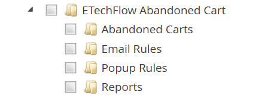

*Figure 35: Add New User Role — Role Resources tab with ETechFlow Abandoned Cart nodes.*

**Step-by-step:**

1. Navigate to `Admin → System → Permissions → User Roles`
2. Click **Add New Role**
3. **Role Info** tab — set name: "Marketing Assistant"
4. **Role Resources** tab — select:
   - ✅ ETechFlow Abandoned Cart → Email Rules
   - ✅ ETechFlow Abandoned Cart → Popup Rules
   - ✅ ETechFlow Abandoned Cart → Reports
   - ❌ ETechFlow Abandoned Cart Configuration (uncheck — hides license)
5. **Save Role**

### 9.3 Assigning a User to the Role

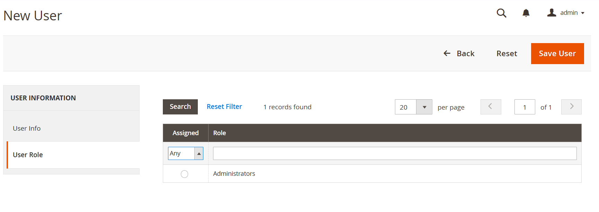

*Figure 36: Add New User → User Role tab.*

1. Navigate to `Admin → System → Permissions → All Users`
2. Click **Add New User**
3. Fill name, email, password
4. **User Role** tab — select "Marketing Assistant"
5. **Save User**

When this user logs in, they'll see only the Marketing menu items they have access to. Configuration sections will be hidden or read-only.

### 9.4 Storefront vs Admin Distinction

| Audience | Access |
|---|---|
| **Storefront customers / guests** | Never any configuration access — extension behavior controlled by admin only |
| **Super Admin** | Full control over everything |
| **Custom admin users** | Whatever ACL grants their assigned role |

---

## 10. Storefront Customer Experience

What customers see from their side of the website.

### 10.1 Cart Abandonment

Nothing visible to the customer. Behind the scenes:

- Observer captures cart snapshot on each cart action
- Customer doesn't see any "you'll be emailed" notice (intentional — not invasive)

### 10.2 Receiving the First Email (T+30 min)

Customer's inbox shows:

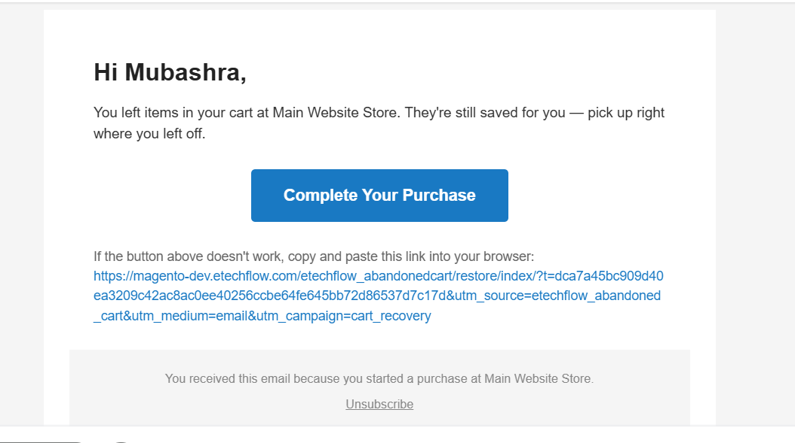

*Figure 37: Gmail inbox showing incoming abandoned cart reminder.*

Subject: *"Don't forget your cart"* (or rule-specific subject from template)

<!-- TODO: 38-email-body-opened.png pending — Gmail email opened fully showing greeting + cart items + restore button + unsubscribe footer -->

Email contents:

- Greeting with customer first name
- Cart items table (product image, name, qty, price)
- Big CTA button: "Complete Your Purchase"
- Footer: unsubscribe link + store name

### 10.3 Clicking the Restore Link

When customer clicks the CTA button:

1. Browser opens `/etechflow_abandonedcart/restore?t=TOKEN`
2. Extension validates token (still valid? not expired? not unsubscribed?)
3. Original quote is loaded into the customer's session
4. If customer was logged in originally + auto-login is enabled, they're logged back in
5. Redirect to `/checkout/cart` — items pre-filled

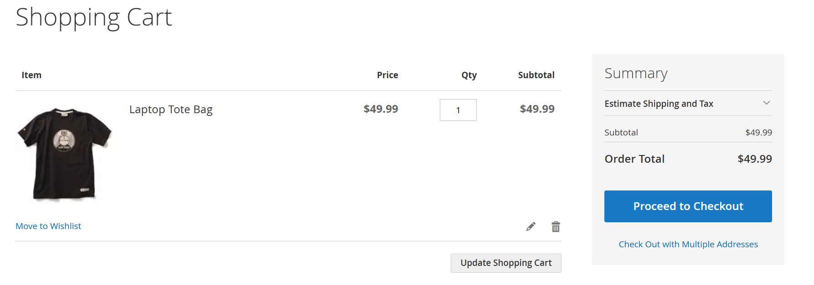

*Figure 39: Cart page after clicking email's restore link — items pre-filled.*

### 10.4 Popup Appearance

Per rule's template + animation. Customer sees:

- Backdrop (modal only) — dims the page
- Dialog with image (if set), headline, body, CTA button
- Close button (X)
- ESC key + backdrop click also close

After clicking CTA with coupon linked:

- Green success strip appears in the popup
- Coupon code shown in monospace font
- "Your discount code XXXX has been applied to your cart!"
- Popup auto-closes after a few seconds (or customer clicks X)

### 10.5 Unsubscribe Flow

If customer clicks "Unsubscribe" in any email:

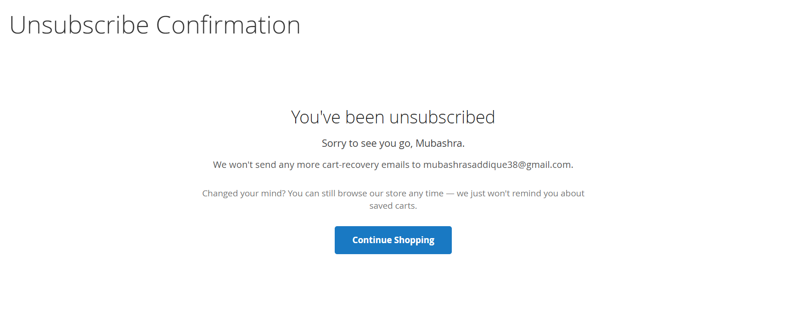

*Figure 40: Unsubscribe confirmation page after customer clicks unsubscribe link.*

1. Browser opens `/etechflow_abandonedcart/unsubscribe?t=TOKEN`
2. Cart's status is updated to `unsubscribed`
3. Confirmation page shown: "You won't receive any more cart reminders from this email."
4. No more emails ever — cron's `findCandidates` query filters by `status = pending` so unsubscribed carts are excluded forever.

---

## 11. Troubleshooting

### 11.1 No Emails Are Being Sent

**Symptoms:** Cart is tracked in DB but `emails_sent` stays 0.

**Checklist:**

1. **Cron running?**
   ```bash
   crontab -l   # should show bin/magento cron:run
   docker exec magento-db mariadb -u<user> -p<pass> magento -e "SELECT * FROM cron_schedule WHERE job_code LIKE 'etechflow%' ORDER BY schedule_id DESC LIMIT 5;"
   ```
   Recent `success` entries should appear. If only `pending`, cron isn't running.

2. **Active rules exist?**
   ```bash
   docker exec magento-db mariadb -u<user> -p<pass> magento -e "SELECT rule_id, name, is_active, send_after_minutes FROM etechflow_abandoned_cart_rule WHERE is_active=1;"
   ```

3. **Cart eligible?** Check `abandoned_at + send_after_minutes ≤ NOW()` AND cart status is `pending` AND emails_sent < sequence_cap.

4. **Manual trigger:**
   ```bash
   docker exec magento-app bin/magento etechflow:abc:send
   ```
   Watch for "Processed: N" output.

5. **Check exception log:**
   ```bash
   docker exec magento-app tail -50 /var/www/html/var/log/exception.log
   ```

### 11.2 Email Sent but Customer Didn't Receive

**Most common cause:** Test Mode is enabled, emails redirected to admin's email.

```bash
docker exec magento-app bin/magento config:show etechflow_abandoned_cart/general/test_mode
# Expected output: 0 (disabled)
```

If `1`, set to `0`:

```bash
docker exec magento-app bin/magento config:set etechflow_abandoned_cart/general/test_mode 0
docker exec magento-app bin/magento cache:flush
```

Other causes:
- SMTP credentials incorrect
- Gmail's spam filter — check spam folder
- Gmail's Promotions tab — sometimes auto-categorized

### 11.3 Popup Not Showing on Storefront

**Checklist:**

1. **Browser console errors?** Open DevTools (F12) → Console tab.

2. **Config JSON present?** In DevTools → Elements, search for `etechflow-popup-config` — should be a `<script type="application/json">` tag.

3. **Endpoint working?**
   ```bash
   curl -s "https://yourstore.com/etechflow_abandonedcart/popup/get?page_scope=all" -H 'X-Requested-With: XMLHttpRequest'
   ```
   Expected: `{"rules":[{...}]}`. If `{"rules":[]}`, no rule matches the current visitor.

4. **Common filters blocking:**
   - `customer_group_ids` doesn't include guest's group (0 = NOT LOGGED IN)
   - `min_cart_subtotal` too high — empty cart doesn't match
   - `frequency` cap hit — visitor already saw popup this session
   - `max_impressions_per_customer` hit

5. **JS file loaded?** Network tab → search "etechflow" → `popup-handler.js` should be Status 200.

### 11.4 PHP 8.4 Deprecation Warnings

If you see warnings like:

```
Implicitly marking parameter as nullable is deprecated
```

This typically affects custom code or third-party extensions. Our extension is PHP 8.4 compatible from v1.1.0+.

### 11.5 Verify Command Reports Failures

```bash
docker exec magento-app bin/magento etechflow:abc:verify
```

14 checks run sequentially. Any FAIL output shows the specific reason — common ones:

| Failure | Likely Cause |
|---|---|
| "DB tables present" | Schema not upgraded after install — run `bin/magento setup:upgrade` |
| "AbandonedCart repo round-trip" | Foreign key constraint — fake test quote ID doesn't exist (cosmetic v1.0.0 bug) |
| "RuleRepository lists rules" | DI compilation needed — run `setup:di:compile` |

### 11.6 Cart Restore Link Shows "Invalid Token"

The restore token has expired (default 30 days). Customer must shop again.

To increase expiry:

```bash
docker exec magento-app bin/magento config:set etechflow_abandoned_cart/restore/token_expiry_days 90
docker exec magento-app bin/magento cache:flush
```

---

## 12. Technical Reference

### 12.1 Module Structure

```
app/code/Etechflow/AbandonedCart/
├── Api/
│   ├── Data/             # Service contracts (interfaces)
│   └── *RepositoryInterface.php
├── Block/
│   ├── Adminhtml/        # Admin UI blocks
│   ├── Frontend/         # Frontend blocks (PopupConfig)
│   └── Email/            # Email rendering blocks
├── Console/Command/       # CLI commands
│   ├── VerifyCommand.php
│   ├── SendCommand.php
│   ├── CleanupCommand.php
│   └── PerfCommand.php
├── Controller/
│   ├── Adminhtml/        # Admin controllers (CRUD)
│   ├── Popup/            # Storefront popup endpoints
│   ├── Restore/          # Cart restore flow
│   ├── Track/            # Open + click tracking
│   └── Unsubscribe/      # Opt-out endpoint
├── Cron/                  # Cron job classes
├── Model/
│   ├── Service/          # Business logic services
│   ├── Source/           # Admin dropdown sources
│   └── ResourceModel/    # DB access layer
├── Observer/              # Event observers
├── Plugin/                # Magento class plugins
├── Setup/                 # Data + schema patches
├── Ui/Component/Listing/  # Admin grid columns
├── etc/                   # XML config
├── view/                  # Frontend + admin templates
└── tools/                 # Internal CLI tools (license generation — NEVER ship to merchants)
```

### 12.2 Database Tables

| Table | Purpose |
|---|---|
| `etechflow_abandoned_cart` | Cart snapshots, restore tokens, recovery state |
| `etechflow_abandoned_cart_rule` | Email rule configuration |
| `etechflow_abandoned_cart_email_log` | Per-email send + engagement history |
| `etechflow_popup_rule` | Popup rule configuration (incl. v1.2.0 visual fields) |
| `etechflow_popup_impression` | Popup show events |

### 12.3 Storefront Endpoints

| URL | Method | Purpose |
|---|---|---|
| `/etechflow_abandonedcart/popup/get` | GET | Returns matching popup rules (JSON) |
| `/etechflow_abandonedcart/popup/track` | POST | Logs popup impression |
| `/etechflow_abandonedcart/popup/apply` | POST | Applies coupon to cart |
| `/etechflow_abandonedcart/restore` | GET | Restores cart from email link |
| `/etechflow_abandonedcart/track/open` | GET | Open-tracking pixel |
| `/etechflow_abandonedcart/track/click` | GET | Click-tracking redirect |
| `/etechflow_abandonedcart/unsubscribe` | GET | Customer opt-out |

### 12.4 CLI Commands

| Command | Purpose |
|---|---|
| `bin/magento etechflow:abc:verify` | End-to-end health check (14 steps) |
| `bin/magento etechflow:abc:send` | Manually trigger send cron |
| `bin/magento etechflow:abc:cleanup` | Run retention cleanup |
| `bin/magento etechflow:abc:perf` | Performance profiling |

### 12.5 Cron Jobs

| Job | Schedule | Purpose |
|---|---|---|
| `etechflow_abandoned_cart_send_reminders` | `*/5 * * * *` (every 5 min) | Pick up eligible carts |
| `etechflow_abandoned_cart_send_queued_emails` | `2-57/5 * * * *` (offset 2,7,12,...) | Transmit queued emails via SMTP |
| `etechflow_abandoned_cart_cleanup` | `0 3 * * *` (daily 3am) | Purge old logs + expired carts |

### 12.6 Configuration Paths (for `bin/magento config:set`)

| Path | Default |
|---|---|
| `etechflow_abandoned_cart/general/enabled` | 1 |
| `etechflow_abandoned_cart/general/abandonment_threshold_minutes` | 30 |
| `etechflow_abandoned_cart/general/test_mode` | 0 |
| `etechflow_abandoned_cart/general/test_recipient_email` | (blank) |
| `etechflow_abandoned_cart/email/sender_identity` | general |
| `etechflow_abandoned_cart/email/max_emails_per_cart` | 3 |
| `etechflow_abandoned_cart/restore/token_expiry_days` | 30 |
| `etechflow_abandoned_cart/restore/auto_login_customer` | 1 |
| `etechflow_abandoned_cart/tracking/open_tracking_enabled` | 1 |
| `etechflow_abandoned_cart/tracking/click_tracking_enabled` | 1 |
| `etechflow_abandoned_cart/cron/batch_size` | 50 |
| `etechflow_abandoned_cart/cron/lock_timeout_minutes` | 30 |
| `etechflow_abandoned_cart/cron/max_runtime_seconds` | 60 |
| `etechflow_abandoned_cart/retention/log_retention_days` | 90 |
| `etechflow_abandoned_cart/license/license_key` | (blank) |
| `etechflow_abandoned_cart/license/is_production` | 0 |

### 12.7 Events Fired by the Extension

| Event | When | Payload |
|---|---|---|
| (none custom — uses Magento's standard events) | — | — |

The extension subscribes to Magento events but doesn't fire its own custom events. To extend behavior, use plugins on the extension's classes.

### 12.8 Plugins / Around-Methods Used

| Target | Plugin | Purpose |
|---|---|---|
| `Magento\Quote\Model\QuoteManagement::submit` | `Etechflow\AbandonedCart\Plugin\Quote\SubmitPlugin` | Defensive recovery detection backup |

---

## 13. Changelog

### v1.2.0 — Visual Templates + Mobile Exit-Intent + UX Fixes

**New Features:**

- 4 visual popup templates (Modal, Slide-In, Bottom Bar, Top Bar)
- 4 entrance animations (Fade In, Slide Up, Zoom In, Bounce)
- 5 admin-editable hex colors (background, headline, body, CTA bg, CTA text)
- Per-rule border radius + dialog width
- Mobile exit-intent — visibilitychange + admin-configurable fallback timer (default 15s)
- Save/Back/Delete/Save-And-Continue button blocks on rule forms

**Schema:** 10 new columns on `etechflow_popup_rule` table.

**Bug Fixes:**

- Nullable `trigger_value` for exit-intent rules without numeric trigger
- PHP 8.4 implicit-nullable parameter deprecations in 3 Grid Collections

### v1.1.0 — Exit-Intent Popup System

**New Features:**

- Complete popup feature: 2 DB tables, admin grid + form, storefront JS handler
- 4 trigger types (Exit Intent, Time on Page, Scroll Depth, Cart Subtotal)
- 5 page scopes (All, Cart, Checkout, Category, Product)
- One-click coupon application via linked Cart Price Rule
- Popup impressions tracking
- Reports dashboard extended with popup KPIs + per-rule breakdown
- Verify command extended to 14 steps

**Theme Support:**

- Luma + Hyvä parallel templates
- Single shared vanilla-JS handler (IIFE, no framework deps)
- Theme-neutral CSS

### v1.0.0 — Initial Release

- Abandoned cart tracking observer
- Email Rules engine
- 3 pre-built email templates (Luma default, Hyvä, With-Coupon)
- 3 cron jobs (send, queue transmit, cleanup)
- Cart restore + click-tracking + open-tracking endpoints
- Unsubscribe flow
- Reports dashboard
- License validator (HMAC-signed, host-locked)
- VerifyCommand (initially 9 steps)

---

## 14. Support

### Contact

**Vendor:** ETechFlow
**Email:** etechflow0@gmail.com
**Website:** https://etechflow.com

### Reporting Issues

When reporting bugs, please include:

1. Magento version + edition (Open Source / Adobe Commerce)
2. PHP version
3. Theme (Luma / Hyvä / custom)
4. Extension version (`bin/magento module:status Etechflow_AbandonedCart`)
5. Verify command output (`bin/magento etechflow:abc:verify`)
6. Last 50 lines of `var/log/exception.log` and `var/log/system.log`
7. Steps to reproduce

### License Terms

This extension is licensed per-domain. The license is **non-transferable** — each Magento installation requires its own license key.

### Updates

Updates are delivered via your purchase channel:
- Composer: `composer update etechflow/module-abandoned-cart`
- ZIP: download latest from your account → replace files → run `setup:upgrade`

After updating:

```bash
bin/magento setup:upgrade
bin/magento setup:di:compile     # production mode
bin/magento cache:flush
bin/magento etechflow:abc:verify # confirm health
```

---

*End of Documentation — Etechflow Abandoned Cart Email & Exit-Intent Popup v1.2.0*

*© 2026 ETechFlow. All rights reserved.*


